# Demos
We'll cover the making of this whole repository in small demos
If you didn't covered the basic EJS project repo, then visit this [link](https://github.com/Yash-Yadav/TechUniteWebAppsNodeJS)
## 1-Setting-up-the-Backend
On the Command line navigate to the directory where you want to save the project on your system, then type in the following commands
* `mkdir URLShortener`
* `cd URLShortener`
* `npm init -y`
  - What this will do is that it will keep init output as per the default template.
  - 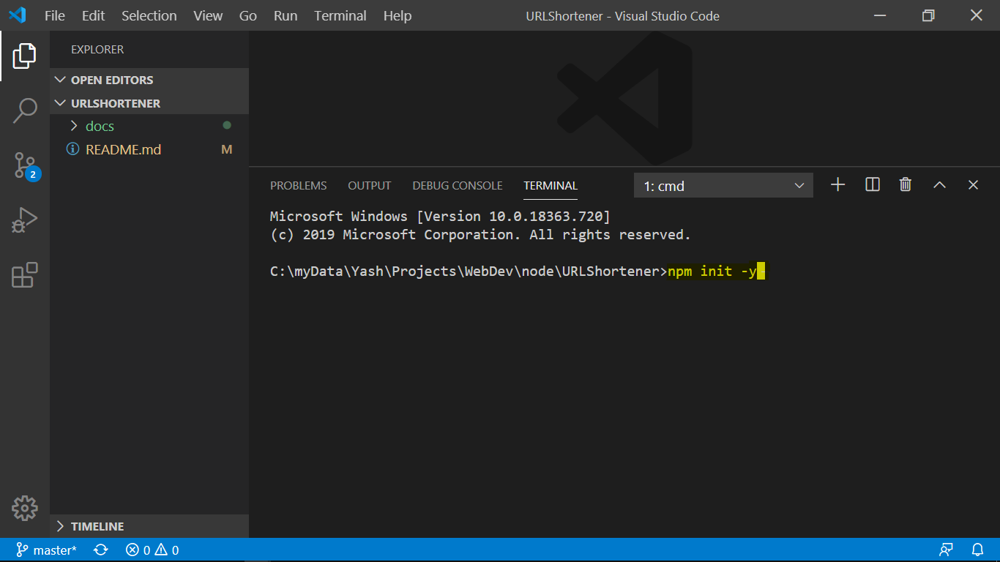
* Explore what `package.json` is. Mainly mention the entrypoint which is `main: index.js`
* How to open the terminal in VSCode (`View > Terminal`)
* Let's install other libraries as well at once, so type in the below command:
  - `npm install express ejs config mongoose shortid valid-url --save`
  - 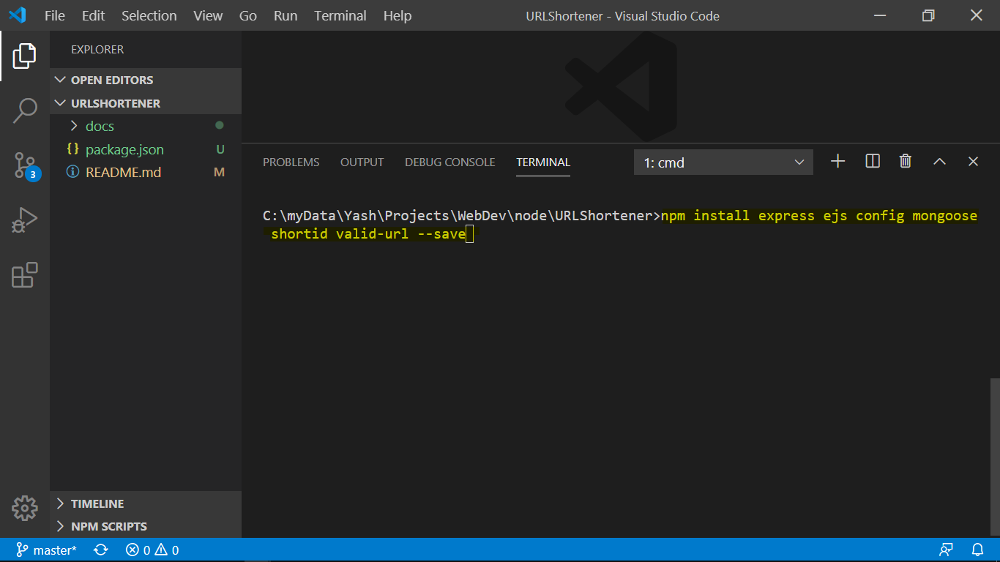
  - What the above step will do is it will record the names of the dependencies which are required to run the package.  
  - 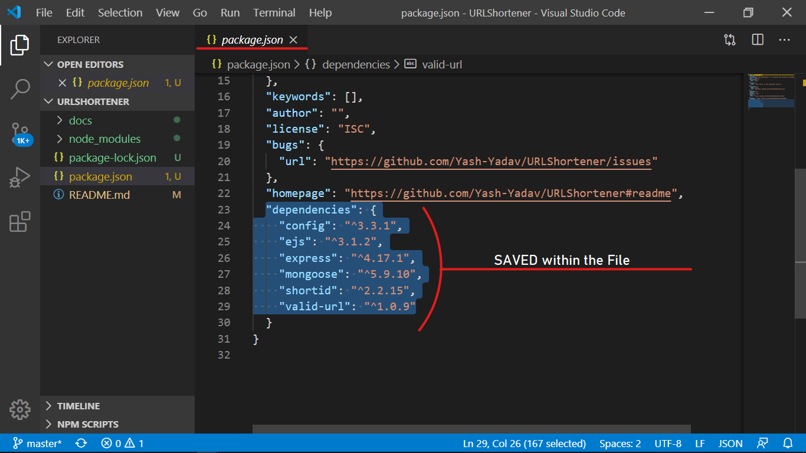
* Create the file `index.js`
* Type in/snippet/copy/paste the following content.
```javascript
const express = require('express');
const app = express();
const port = process.env.PORT || 3000;

// ..

app.get('/', (req, res) => res.send('Hello world'));
app.listen(port, () => console.log('Application started at => http://localhost:'+port));
```
* Run the code by this command: `node index.js` and go to localhost:3000. To see the Home Page.
  - 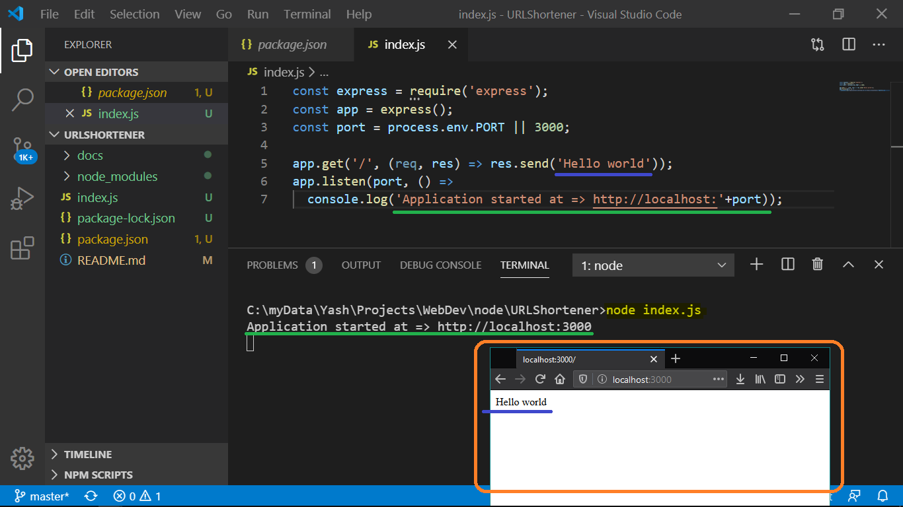
* Next let's just get rid of this continuously pressing F5 or typing in `node index.js` again and again.
* So to automate this process we've a papckage called "nodemon". So lets install it: `npm i nodemon --save-dev`
  - 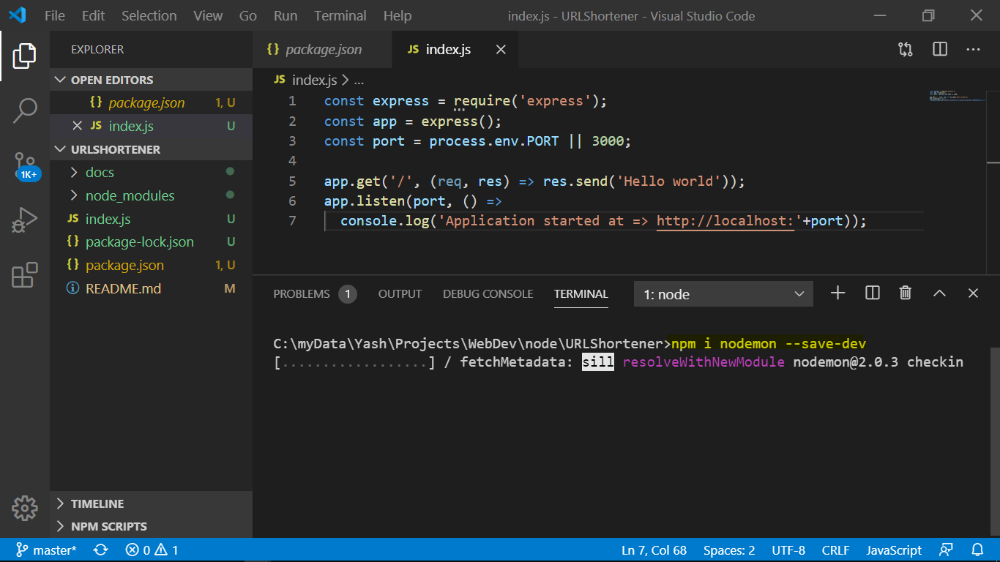
* Now lets see the `package.json` file, and add some script to it, so that it can trigger nodemon whenever we run that dev script.
* Replace the below snippet with the later one:
  - To be replaced
    + ```json
      "scripts": {
        "test": "echo \"Error: no test specified\" && exit 1"
      }
      ```
  - To be replaced by
    + ```json
      "scripts": {
        "start": "node index",
        "dev": "nodemon index"
      }
      ```
  - 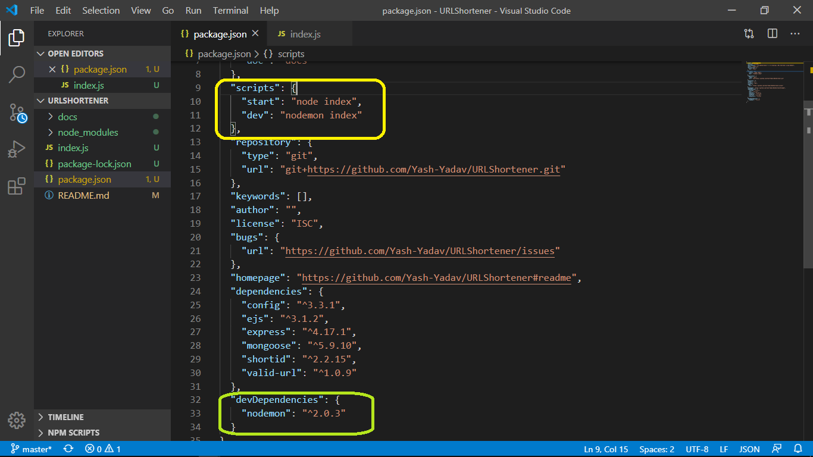
* Use the below code snippet in the `index.js` file (remove all the previous code):
```javascript
const express = require('express');
const app = express();
const port = process.env.PORT || 3000;

app.use(express.json({extended: false}));
app.use(express.urlencoded({extended: false}));
app.set('view engine', 'ejs');

app.get('/', (req, res) => {
  res.render('home');
});


app.listen(port, () =>
  console.log('Application started at => http://localhost:'+port));
```
* Here the statement app.use(express.json(-------)); is a [Middleware](https://azure.microsoft.com/en-us/overview/what-is-middleware/) which will allow us to accept JSON data into our API.
## Setting-up-Directory-structure
* Create folders & files inside the project directory as per thie below given List:
  * config (Folder)
    - `db.js`
    - `default.json`
  * models (Folder)
    - `Url.js`
  * routes (Folder)
    - `urlRedirect.js`
    - `url.js`
  * views (Folder)
    - `home.ejs`
## Building-a-basic-Front-End
* Now use the below snippet for the `home.ejs` file:
```html
<!DOCTYPE html>
<html lang="en">
<head>
  <meta charset="UTF-8">
  <meta name="viewport" content="width=device-width, initial-scale=1.0">
  <title>UNITE- URL Shortner 😍</title>
  <link rel="stylesheet" href="https://stackpath.bootstrapcdn.com/bootstrap/4.4.1/css/bootstrap.min.css" integrity="sha384-Vkoo8x4CGsO3+Hhxv8T/Q5PaXtkKtu6ug5TOeNV6gBiFeWPGFN9MuhOf23Q9Ifjh" crossorigin="anonymous">
</head>
<body>

  <div class="container-fluid">
    
    <div class="jumbotron" style="text-align: center;">
      <h1 class="display-4">Welcome to the URL Shortner</h1>
    </div>
    
    <!-- FORM -->

    
    <!-- URLs Table -->

    
    <footer class="footer container-fluid my-4">
      <hr>
      <span class="row justify-content-center text-muted">
        Copyright
        <% const date = new Date(); %>
        <%= date.getFullYear() %>
      </span>
    </footer>
  </div>
</body>
</html>
```
* In this above code we've used a 3rd party frontend css library to speed up our front end jobs beautifully.
* Now lets see the implementation of the said tool `nodemon`.
* in the command line, preferably in the VS Code, type: `npm run dev`
  - 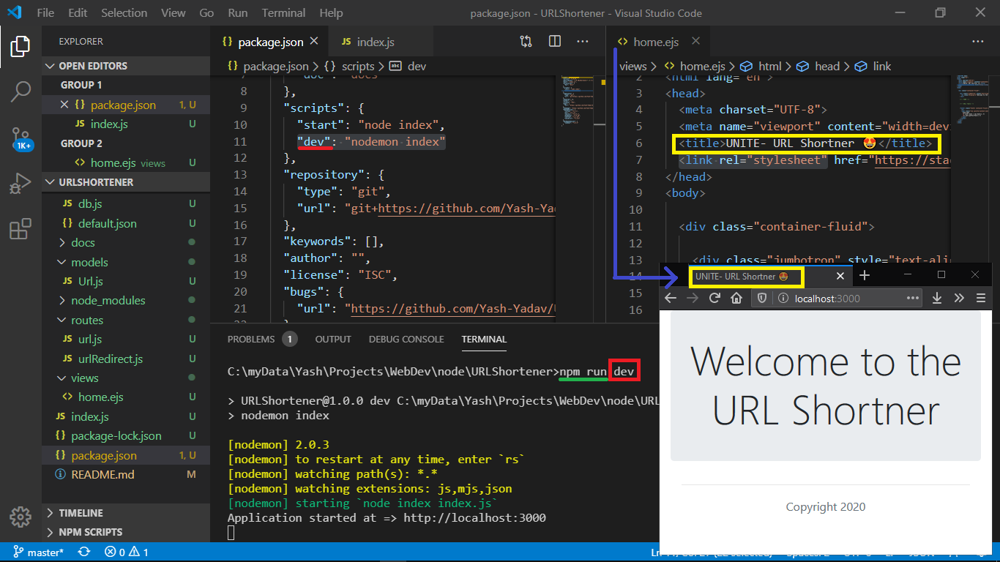
* Now comes the snippet for the url shortening form in teh `home.ejs` file. Place the below snippet right below the `<!-- FORM -->` Comment in the html file:
```html
<!-- FORM -->
    <form action="/shorten/" method="POST" style="padding: 0 25px 0 25px;">
      <div class="form-group row justify-content-md-center">
        <label class="col-lg-1 col-md-10" for="longUrl">Long URL: </label>
        <input required="" type="url" class="col-lg-3 col-12 form-control" name="longUrl" id="longUrl" placeholder="Enter your Name">
      </div>
      <div class="form-group row justify-content-md-center">
        <label class="col-lg-1 col-md-10" for="shortUrl">Short URL: </label>
        <input type="text" class="col-lg-3 col-12 form-control" id="shortUrl" name="shortUrl" placeholder="Enter the custom name (if any)">
      </div>
      <div class="form-group row justify-content-md-center">
        <button type="submit" class="col-12 col-lg-4 btn btn-primary">Submit</button>
      </div>
    </form>
```
and the Table code below the Table Comment `<!-- URLs Table -->`:
```html
<!-- URLs Table -->
    <div style="margin: auto;" class="row justify-content-md-center table-responsive-sm">
      <table style="padding: 0 25px 0 25px;" class="table table-hover col-12 col-md-10 col-lg-6">
        <thead>
          <tr>
          <th># ID</th>
          <th>Long URL</th>
          <th>Short URL</th>
          <th>Clicks</th>
          </tr>
        </thead>
        <tbody>
          <tr>
            <th scope="row">#</th>
            <td><a target="_blank" href=#">Long URL Comes Here</a></td>
            <td><a target="_blank" href="#">Short URL Comes Here</a></td>
            <td>0</td>
          </tr>
        </tbody>
      </table>
    </div>
```
* Now refresh the browser page
  - 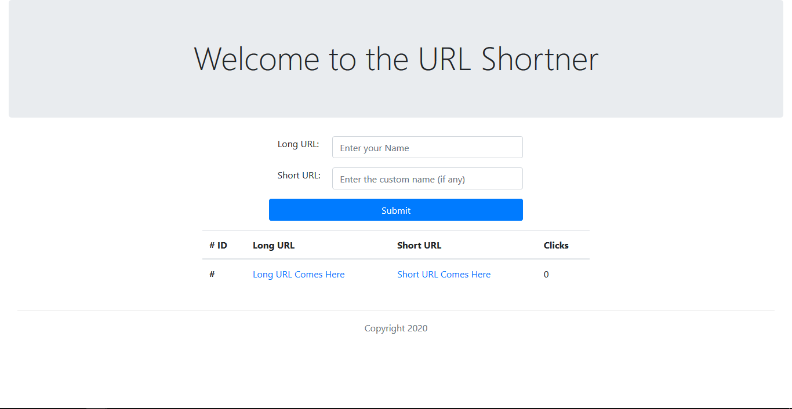
## Connecting-to-our-Database
* Now lets head to the package that we added `config` in the `npm install` command, what it does is that it will look for `default.json` file inside config (folder) which we created earlier that will consist of the global variables for our project. 
* Now lets open that `default.json` file and place the below snippet in it:
```json
{
  "mongoURI": "<ConnectionStringHere>"
}
```
* We'll replace the Connection String from the cluster's string from our Atlas Account (if you still don't have an account, click [here](https://www.mongodb.com/atlas-signup-from-mlab) to create one)
* After Logging in to the Atals, create a free Cluster and add a database user in it
  - 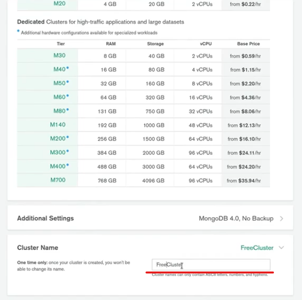
  - 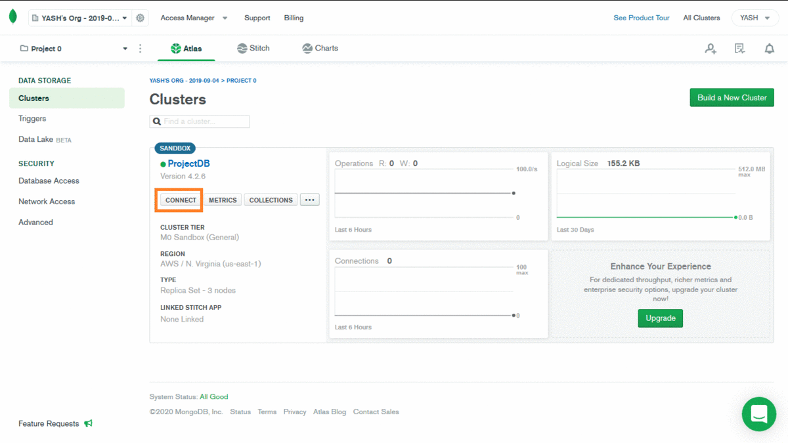
* Now use the below code in the `db.js` file inside the config (folder):
```javascript
const mongoose = require('mongoose');
const config = require('config');

// Grab the Connection string URL from the default.json file
const db = config.get('mongoURI');

const connectDB = async () => {
  try {
    await mongoose.connect(db, {
      useNewUrlParser: true,
      useUnifiedTopology: true
    });
    console.log('MongoDB Connected');
  } catch (err) {
    console.log(err.message);
  }
}

module.exports = connectDB;
```
* Add the below given code right below the 3rd line in the index.js file:
```javascript
const connectDB = require('./config/db');
// Connect to Database
connectDB();
```
  - 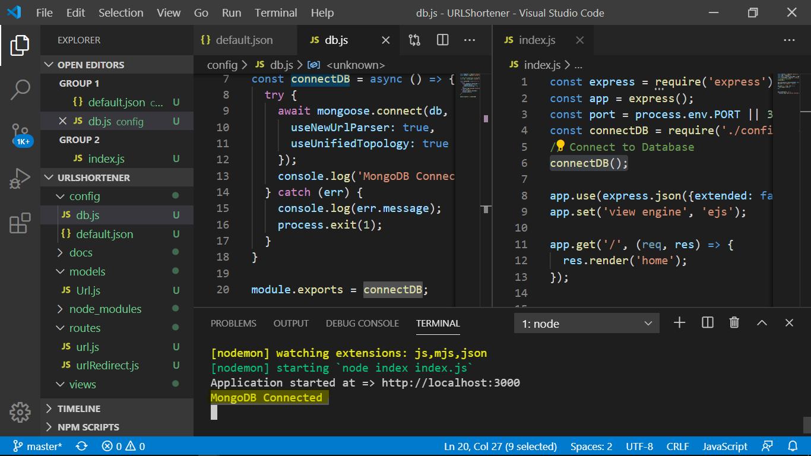
* So we're now connected with our Database
## Creating a Schema for our Data
* Place the below Schema code into the `Url.js` present in the `models` folder
```javascript
const mongoose = require('mongoose');
const urlSchema = new mongoose.Schema({
  urlCode: String,
  longUrl: String,
  shortUrl: String,
  date: {
    type: String,
    default: Date.now
  },
  clicks: {
    type: Number,
    required: true,
    default: 0
  }
});

module.exports = mongoose.model('Url', urlSchema);
```
## Setting-up-the-Routes-for-the-app
* So as we created a folder of `routes` earlier, we'll use it store various routes of our app.
before that let's link those routes in the main `index.js` file.
* Place the below code in the `index.js` file right before the get('/'----) route:
```javascript
// Define Routes----------------
// Route-> Redirection
app.use('/', require('./routes/urlRedirect'));
// Route-> Shortening
app.use('/shorten', require('./routes/url'));
``` 
* Now comes the code part for the 2 routes:
  - `url.js`
  ```javascript
  const express = require('express');
  const router = express.Router();
  const validUrl = require('valid-url');
  const shortid = require('shortid');

  const Url = require('../models/Url');

  // @route   POST /api/url/shorten
  // @desc    Create short URL
  router.post('/', async (req, res) => {
    const longUrlPassed = req.body.longUrl;
    const shortUrlPassed = req.body.shortUrl;
    
    const baseUrl = "http://" + req.headers.host;

    // Check base url
    if(!validUrl.isUri(baseUrl)) {
      res.status(401).json('Invalid base url');
    }
    
    urlCode = shortid.generate();
    if (shortUrlPassed === '') {
      // Create url code
    } else {
      urlCode = shortUrlPassed;
      let url = await Url.findOne({ urlCode });
      // If already exisits
      if(url) {
        // Then redirect to the Home Page
        return res.redirect(baseUrl);
      }
    }
    
    // Check long url
    if (validUrl.isUri(longUrlPassed)) {
      try {
        let url = await Url.findOne({ longUrl: longUrlPassed });
        const shortUrl = baseUrl + '/' + urlCode;

        url = new Url({
          longUrl: longUrlPassed,
          shortUrl,
          urlCode
        });
        await url.save();

        return res.redirect(baseUrl);
        res.json(url);
      } catch (err) {
        console.log(err);
        res.status(500).json('Server error');
      }
    }
    else {
      res.status(401).json('Invalid Long url');
    }

  });

  module.exports = router;
  ```
  - `urlRedirect.js`
  ```javascript
  const express = require('express');
  const router = express.Router();

  const Url = require('../models/Url');

  // @route   GET  /:code
  // @desc    Redirect to long/original URL
  router.get('/:code', async (req, res) => {
    try {
      const url = await Url.findOne({ urlCode: req.params.code });

      if (url) {
        url.clicks++;
        await url.save();
        return res.redirect(url.longUrl);
      } else {
        return res.status(404).json('No url found');
      }
    } catch (err) {
      console.log(err);
      res.status(500).json('Server error');
    }
  })

  module.exports = router;
  ```
* Now lets test the app. Just save the files and open the `localhost:3000`.
* When we'll pass some valid url in the long Url field from the form and then submit the form, then you'll be redirected to the home page only.
* But the catch here is that we can't see the data that we recorded from the form, on our Home page. Though it can be seen from the Atlas Collection.
* So lets now render the urls shortened.
Place the below code into the `index.js` file, just above this line `res.render('home');` inside the Home Page Route. Now the HomePage route looks like this:
```javascript
// Route-> Home Page
app.use('/', async(req, res) => {
  const urls = await Url.find();
  res.render('home', {urls: urls});
});
```
* Do add the below statement to  make the above `const urls....` statment work:
```javascript
const Url = require('./models/Url');
```
* Now lets work on the final part i.e. the Front End `home.ejs` file replace the code of the tables div as below
```html
<div style="margin: auto;" class="row justify-content-md-center table-responsive-sm">
  <table style="padding: 0 25px 0 25px;" class="table table-hover col-12 col-md-10 col-lg-6">
    <thead>
      <tr>
      <th># ID</th>
      <th>Long URL</th>
      <th>Short URL</th>
      <th>Clicks</th>
      </tr>
    </thead>
    <tbody>
      <%
        var index = 1;
        urls.forEach(url => { %>
      <tr>
        <th scope="row"><%=index %></th>
        <td><a target="_blank" href="<%= url.longUrl %>"><%= url.longUrl %></a></td>
        <td><a target="_blank" href="<%= url.urlCode %>"><%= url.urlCode %></a></td>
        <td><%= url.clicks %></td>
      </tr>
      <%
      index+=1;
      }) %>
    </tbody>
  </table>
</div>
```
* Now Run and Test the Newly created Url Shortener.
  - 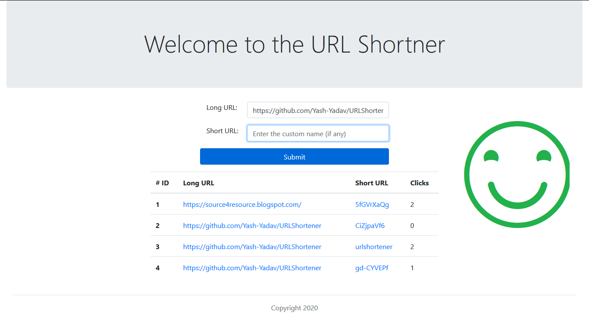
  - 

Feel Free to contact me. DMs are always Welcome.

## Pushing-Project-to-GitHub-and-Azure
For the detailed steps follow this [link](https://github.com/Yash-Yadav/TechUniteWebAppsNodeJS/blob/master/demos/README.md#demo-3---pushing-to-azure)
